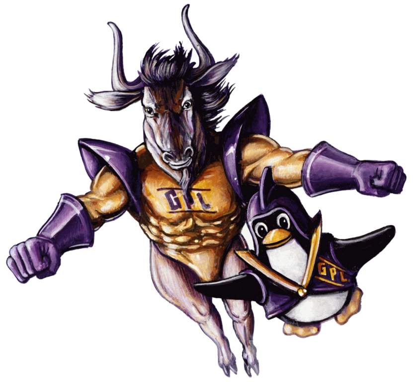

[//]: # (Title of the project)

# Noot: A GNU distribution

[//]: # (Repository badges)

[//]: # (README Body)

(...)

## Table of Contents

- [Flavors (Kernel)](#flavors-kernel)
  - [The Tux Edition](#the-tux-edition)
  - [The Freedo Edition](#the-freedo-edition)
  - [The Hurd Edition](#the-hurd-edition)

## Flavors (Kernel)

(...)

### The Tux Edition

(...)

### The Freedo Edition

(...)

### The Hurd Edition

(...)
